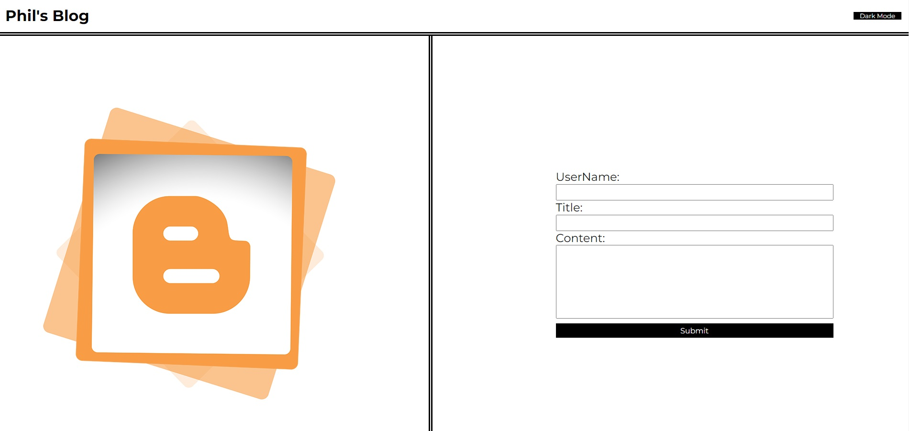
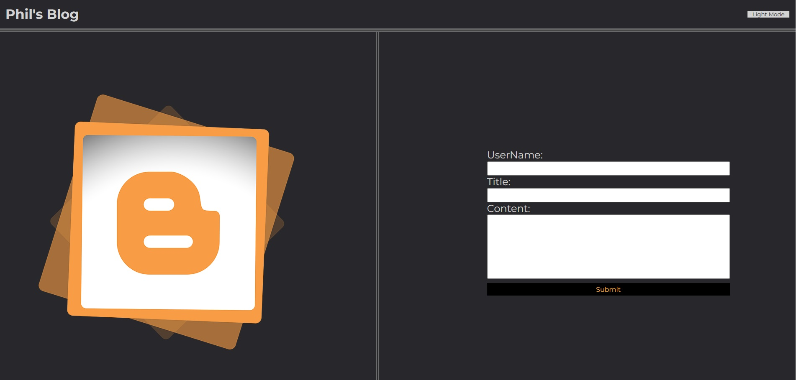
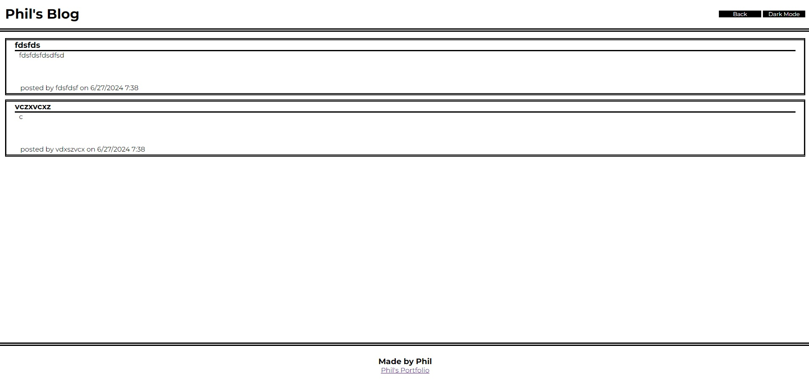
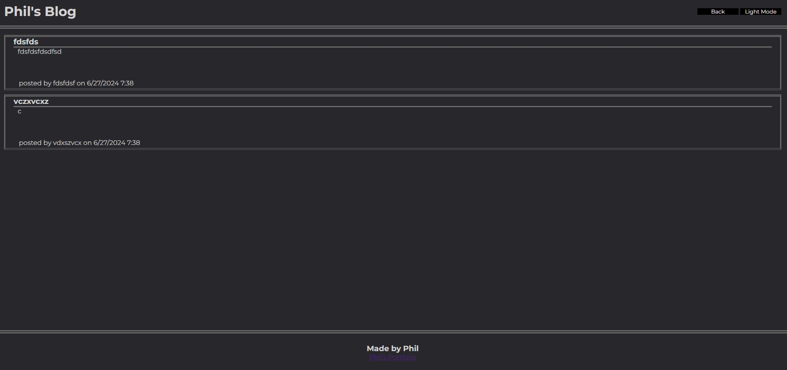

# Blog Website
## Description
This project was undertaken as part of a coding bootcamp. This was the fourth challenge project. The goal was to create a blog website that took in the username, title, and content of a blog post which would be stored in the local starage then out put on a seperate page for the user to view. THe page also needed to ave button to change into dark mode and back to light mode.
## Installation
If you wish to run this project locally on your own computer, assuming you have git installed, input the following code in your terminal.
git clone https://github.com/philcurtis4/blog_website_4
## Usage
The live site may be viewed at the following url.
https://philcurtis4.github.io/blog_website_4/

Here is a screenshot of the page.

    
## Credits
Created by Philip Curtis
I followed this guide to create this README.md file
https://coding-boot-camp.github.io/full-stack/github/professional-readme-guide
## License
This project has a MIT License. For more information read the LICENSE file.
---